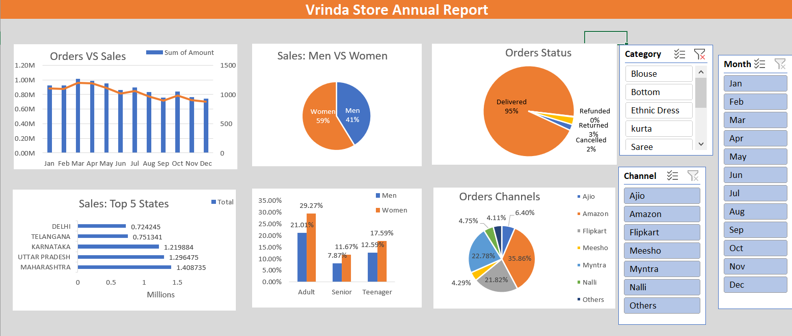

# Vrinda Store Data Analysis

This project showcases a beginner-level yet professional-looking Excel Dashboard focused on retail data analytics. The objective was to clean the data, process it, and generate meaningful visual insights using Pivot Tables and Charts in Microsoft Excel.

---

## Step 1: Data Cleaning

- Opened the Excel dataset and checked for null/missing values
- Removed all blank rows/entries manually or using Excel filters
- Ensured correct data types:
  - Date fields as Date
  - Text fields like Gender or State as Text
  - Numeric fields like Amount as Number

---

## Step 2: Data Processing

### Age Categorization
Grouped age data into categories:
- Teenager: 13–19
- Adult: 20–59
- Senior: 60+

```
=IF(Age<20,"Teenager",IF(Age<60,"Adult","Senior"))
```
## Step 3: Data Analysis and Dashboard Creation
### 1. Orders vs Sales Over Time
#### Pivot Table:

- Month in Rows

- Amount (Sum) and Order ID (Count) in Values

#### Chart:

- Combo Chart with:

- Column Chart for Order Count

- Line Chart for Total Sales

- Order Count placed on a secondary axis

#### Formatting:

- Gridlines and field buttons disabled

- Axis labels formatted in Millions using:
```
Axis → Format → Number Format → 0.00,,"M"
```
### 2. Gender-Based Spending
#### Pivot Table:

- Gender in Rows

- Amount in Values (Sum)

#### Chart:

- Pie Chart with percentage labels

- Legend removed

- Labels placed cleanly with no fill or outline

### 3. Order Status Breakdown
#### Pivot Table:

- Order Status in Rows

- Order ID in Values (Count)

#### Chart:

- Pie Chart displaying proportions of statuses (e.g., Delivered, Pending)

- Legend removed

- Custom label placements applied

### 4. Order Channels
#### Pivot Table:

- Order Channel in Rows (Online, In-Store, etc.)

- Order ID in Values (Count)

#### Chart:

- Pie Chart showing the share of each channel

- Clutter-free: no legend, filled slices removed

- Labels placed inside slices for a clean layout

### 5. Top States by Order Count
#### Pivot Table:

- State in Rows

- Order ID in Values (Count)

#### Chart:

- Horizontal Bar Chart

- Values sorted from largest to smallest

### 6. Age and Gender Analysis
#### Pivot Table:

- Age Category and Gender in Rows

- Order ID or Amount in Values

#### Chart:

- Clustered Column Chart to compare age and gender groups

- Visualized which demographics are most active

## Files Included
- Vrinda Store Data Analysis.xlsx – Full Excel workbook with data, pivot tables, and dashboard

- Rough_Documentation.txt – Rough documentation notes used during planning

- Dashboard Screenshot.png –Screenshot of the final dashboard

## Key Learnings
- Cleaning and categorizing data manually in Excel

- Using Pivot Tables for quick insights

- Designing effective and aesthetic dashboards

- Combining charts like Combo, Pie, and Bar Charts

- Turning raw data into business-focused decisions
